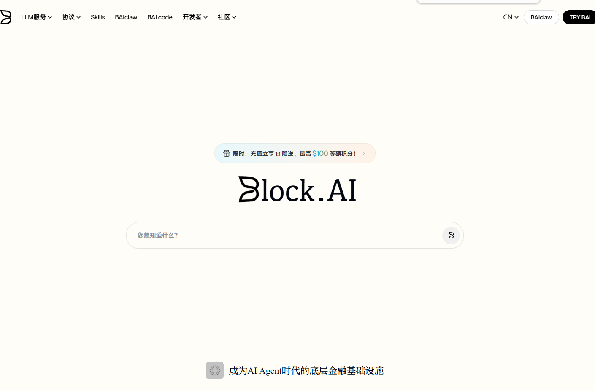
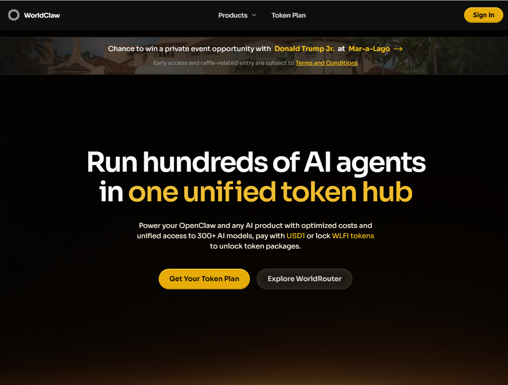
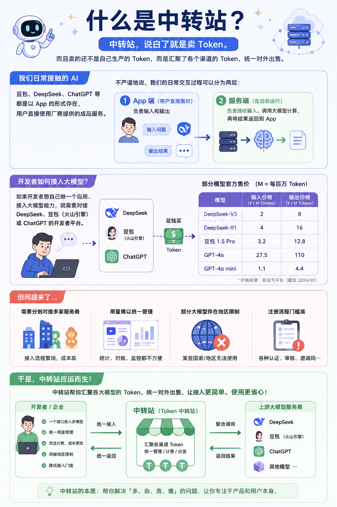
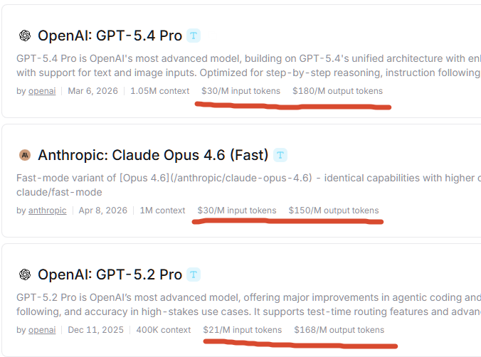
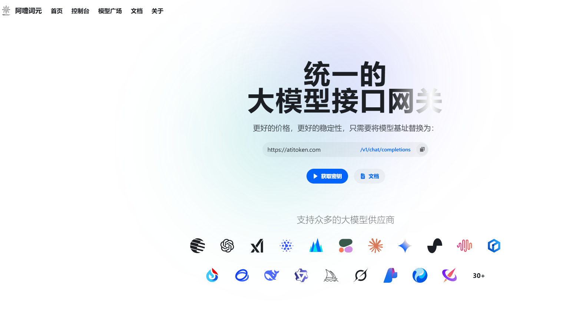
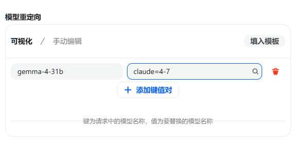
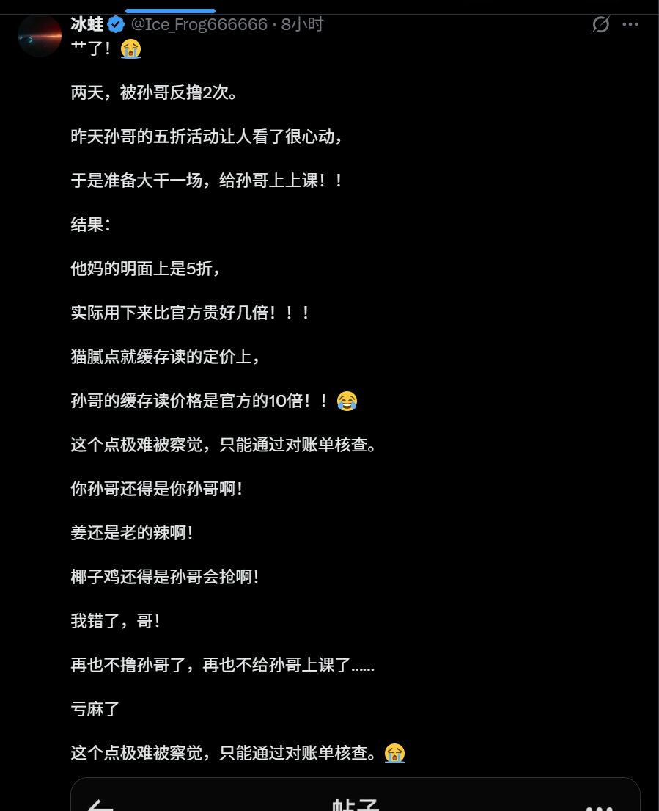

前有币圈孙割（孙宇晨）上线 b.ai，支持用 API Key 调用各种大模型，新用户注册即送 0.5 美元额度。

后有懂王下海——特朗普家族旗下 WLFI 生态推出了名为 **WorldClaw / WorldRouter** 的项目。看来，操纵股票都比不上开中转站来钱快！

## 什么是中转站

**中转站，说白了就是卖 Token。** 而且卖的还不是自己生产的 Token，而是汇聚了各个渠道的 Token，统一对外出售。

我们日常接触的 AI——豆包、DeepSeek、ChatGPT 等——都是以 App 的形式存在，用户直接使用厂商提供的成品服务。

> 不严谨地说，我们的日常交互过程可以分为**两层**：
> - **第一层是 App 端**，用户直接面对，负责输入和输出；
> - **第二层是服务端**，负责接收输入、调用大模型计算，再将结果返回到 App。

假如一个开发者想自己做一个应用、接入大模型能力，就需要对接 DeepSeek、豆包（火山引擎）或 ChatGPT 的**开发者平台**。这些平台会以最直接的方式给你 Token——**花钱买**。

下面是部分模型的官方售价（M = 每百万 Token）：

**但问题来了：** 如果开发者想同时接入多个大模型，就需要分别对接多家服务商，用量也不好统一管理。更不用说，有的大模型存在**地区限制**，有的注册流程设置了各种离谱的门槛。

**于是，中转站应运而生。**

你只需要在中转站注册、充值，拿到一个 API Key，就可以**一站式调用多个模型**。

## 中转站怎么赚钱

中转站赚钱的核心逻辑就一个字——**差价**。

正规渠道的 Token 价格很难压低，除非遇到 DeepSeek 发布首月就打 2.5 折、或小米送出 100 万亿 Token 这类限时活动。所以，**售价低于官方价格的中转站，要么在计费方式上做了手脚，要么 Token 来路不正、掺了水。**

> 至于其他黑灰手段，来源主要就是**薅羊毛**：比如利用 ChatGPT 一个月的 Plus 试用期，批量开出成百上千个账号组成号池；再比如通过各种工具把网页版转成 API 接口（这也是厂商 TOS 明令禁止的）。

再说说**什么是"模型掺水"**。中转站一般采用 NewAPI 系统搭建，首页通常长这样：

在后台添加模型渠道时，站长可以**自行设置别名**——也就是说，你看到的模型名称，未必是实际调用的模型。

**所以，中转站这潭水，深得很。**

## 为什么特朗普和孙割都下场了

孙割下场是为了割韭菜，这不奇怪。

特朗普天天操纵股票、卖卖军火，还瞧得上中转站这点小生意？

**说白了，他们都是在打造生态。**

特朗普的 **WorldClaw / WorldRouter** 直接把入口、支付（用 USD1 稳定币结算）、使用**打包成一条龙**，甚至还能解锁与特朗普共进晚餐的机会。**他们真正想抓住的，是 AI 时代的"水电煤气"——基础设施级的流量入口，这才是真正决定生产力的东西。**

## WorldRouter 的底牌：不是技术，是政商资源

从产品层面看，WorldRouter 并无独到之处——它不研发模型，不提供独有能力，本质上和国内大量 API 聚合平台（如 OpenRouter）别无二致。它真正的差异化在于：**把链上支付（USD1）和代币激励（WLFI）嵌入了商业模式，再借助特朗普家族的品牌和政商网络进行推广。**

> 更值得警惕的是背后的利益结构：WLFI 代币目前价格仅约 0.08 美元，较历史高点暴跌超 80%。WorldRouter 恰好为 WLFI 创造了一个"消费场景"——锁定代币换 AI 额度、用 USD1 结算调用费用，本质上是**在给代币续命**。当一个在任美国总统的家族，把自己的加密代币与 AI 调用直接捆绑，这件事在监管层面的意义，远大于产品本身。

WorldRouter 刚刚上线，能否跑通尚未可知。但有一点已经确定：**特朗普家族已找到一种新的缝合术，把政治品牌、加密代币和 AI 热度拧成了一股绳。**

---

最后，为了让大家亲手体验一下中转站到底是什么，我自己也搭了一个：**https://api.atitoken.com/** （仅供体验，服务器月底就到期了），接入了火山引擎、OpenRouter 啥的模型，注册即送 1 美元额度。感兴趣的朋友欢迎体验，有问题可以后台留言交流。
